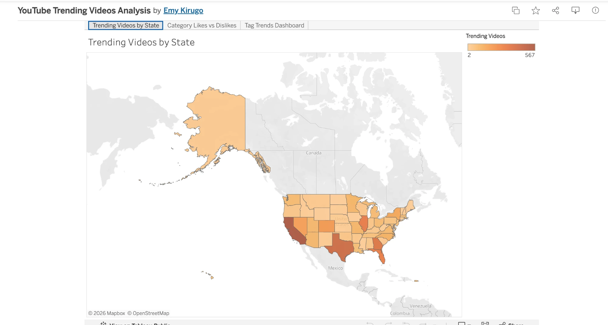
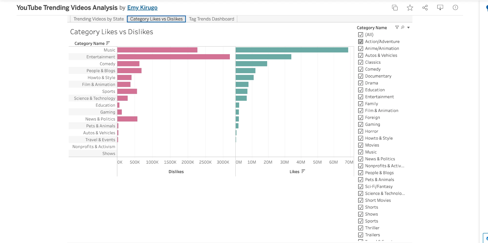
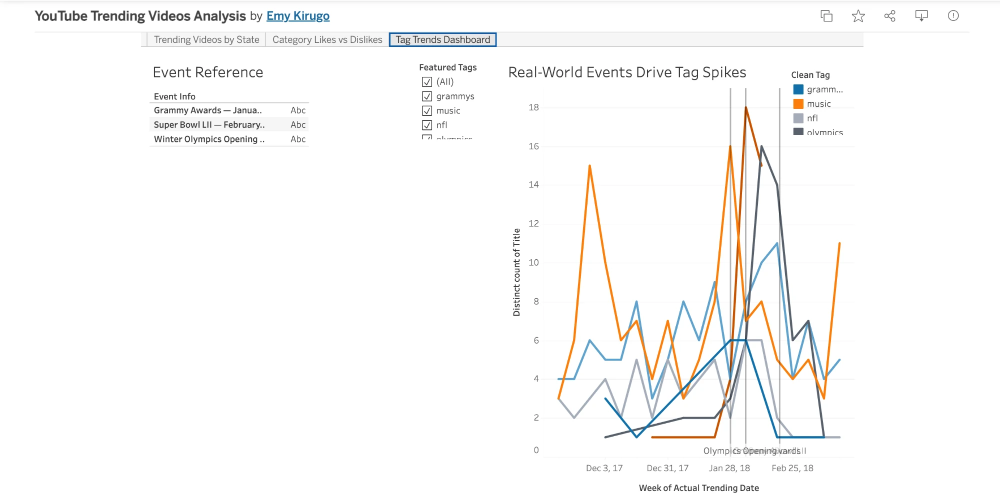

# YouTube Trending Videos Analysis

Data visualization project by **Emy Kirugo**, built in Tableau Public, exploring the US YouTube Trending Videos dataset (Nov 2017 – Mar 2018). Each video's cumulative statistics were de-duplicated to reflect only its final (last) day of trending, so likes, dislikes, and view counts aren't overstated across a video's multi-day trending run.

**Dataset:** [YouTube Trending Video Statistics](https://www.kaggle.com/datasnaek/youtube-new) (Kaggle, `datasnaek/youtube-new`), provided through Udacity project materials, including the supplementary tag-transposition and category-name lookup files provided for the project.

**Full written report:** [YouTube_Trending_Videos_Analysis_Report.pdf](./YouTube_Trending_Videos_Analysis_Report.pdf)

---

## Insight 1: Trending Videos by State

**Live viz:** https://public.tableau.com/shared/J97XWJQFH?:display_count=n&:origin=viz_share_link

This map shows how many distinct trending videos originated from each US state. California leads by a wide margin with 567 trending videos, followed by Texas (433), Georgia (369), Illinois (330), and Florida (321). While the top states generally track with population size, Georgia stands out: it ranks 8th in US population but 3rd in trending videos, ahead of larger states like New York — lining up with Atlanta's well-documented role as a hub for hip-hop, comedy, and film/TV. This suggests Atlanta functions as a media capital on par with more traditionally recognized hubs like Los Angeles and New York.

A filled (choropleth) map was chosen because state-level geographic comparison is the clearest way to answer a location-based question. A single-hue sequential palette (light to dark orange) was used rather than a diverging scale, since the measure is a simple count with no inherent "good" or "bad" direction.

## Insight 2: Category Likes vs. Dislikes

**Live viz:** https://public.tableau.com/views/YouTubeTrendingVideosAnalysis_17853905656380/CategoryLikesvsDislikes

This chart compares total likes and dislikes across all 16 video categories. Music dominates likes with roughly 68.7 million, more than double the runner-up, Entertainment, at about 34.0 million. The dislike totals tell a more interesting story: despite having far fewer likes than Music, Entertainment accrued more total dislikes (~3.19M vs Music's ~2.27M) — a noticeably more polarized audience reaction relative to its popularity.

A horizontal bar chart split into two independently scaled panes was used instead of a single shared axis, since Likes are measured in the millions while Dislikes are measured in the thousands. Teal/pink were used instead of a red/green traffic-light scheme, since more dislikes isn't necessarily a negative outcome here — it can simply reflect a more engaged, opinionated audience.

## Insight 3: Real-World Events Drive Tag Spikes (Dashboard)

**Live viz:** https://public.tableau.com/views/YouTubeTrendingVideosAnalysis_17853905656380/TagTrendsDashboard

This line chart tracks the weekly popularity of six selected tags across the full trending window. Three tags ('Grammys', 'super bowl', 'Olympics') are tied to specific real-world events; the remaining three ('NFL', 'music', 'science') serve as an evergreen baseline. Each event-tied tag spikes sharply in the exact week of its real-world event, then falls off almost as quickly — 'Grammys' peaks at the 2018 Grammy Awards (Jan 28), 'super bowl' spikes the following week at Super Bowl LII (Feb 4), and 'Olympics' stays elevated through the full 2018 Winter Olympics window (Feb 9–25). By contrast, the evergreen tags rise and fall on their own independent schedule with no single triggering moment.

A manually curated set of six tags was used instead of an automatic "Top N" ranking, to avoid surfacing near-duplicate synonyms for comedy content. Three labeled vertical reference lines mark the exact event dates, and Tableau's built-in Color Blind palette was used so the six tag lines remain distinguishable for readers with color vision deficiency.
